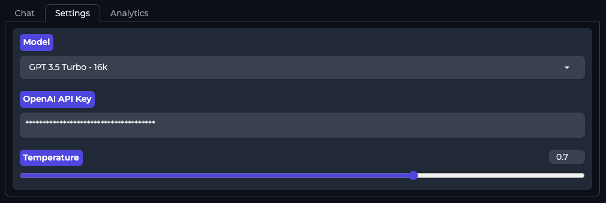

## Welcome!
Hi! GPT - 4U is a modern and security-focused interface for Large Language Models. I've included a host of features that I hope you enjoy. Feel free to use it, share it, modify it, and use it however you want (legally of course 😘). No need to attribute me or even ask for my permission. It's completely free! 

Features:
- Most users save anywhere from 50% to 75%. Pay as you use it, no need to pay an exorbitant fixed monthly fee.
- All your chat histories are stored in local text files. This means they can easily be moved, stored, or synced with your team via a plethora of cloud storage services. Think of the possibilities for team collaboration!
- Provides usage statistics.
## How To Run
### Docker-ized Version (Recommended for beginners)
I created a Docker image to package this application. To run the Docker Container:
1. Verify the [Docker Desktop](https://www.docker.com/products/docker-desktop/) application is installed.
2. In terminal, run the command `Docker build -t gpt4u .`
3. In terminal, run the command `Docker run -it -p 7860:7860 gpt4u`
4. In your browser enter the url http://0.0.0.0:7860 and hit enter.
5. The user interface will launch.

### Run Directly
1. Open the terminal to `GPT-4U`.
2. In terminal, run the command `pip install -r Requirements.txt`
3. In terminal, run the command `python3 webapp-launch.py`
4. In your browser enter the url http://0.0.0.0:7860 and hit enter.
5. The user interface will launch.

## Roadmap
- [ ] Advanced usage statistics.
- [ ] Custom/Local LLM support.

More Images
